# **Vietnamese Legal Chatbot** 🏛️⚖️

A Retrieval-Augmented Generation (RAG) system designed to answer legal questions in Vietnamese, providing accurate and contextually relevant responses based on Vietnamese legal documents.

[](https://huggingface.co/spaces/fisherman611/vietnamese-legal-chatbot)
[](LICENSE)
[](https://python.org)

## **Features**

- **Advanced RAG Architecture** - Combines vector search, BM25, and cross-encoder reranking for optimal document retrieval
- **Hybrid Search** - Uses both semantic similarity (vector search) and keyword matching (BM25) to find relevant documents
- **Question Refinement** - Improves query understanding through automatic question refinement
- **Cross-Encoder Reranking** - Employs cross-encoder reranking to improve the accuracy of retrieved documents.
- **Fallback Mechanisms** - Integrates with Google Search to provide answers when legal documents are insufficient.
- **Vietnamese-Optimized** - Specifically designed for Vietnamese language processing and legal terminology

## **Dataset**
The dataset used is from the [[Zalo-AI-2021] Legal Text Retrieval](https://www.kaggle.com/datasets/hariwh0/zaloai2021-legal-text-retrieval/data) dataset. Please download and restructure it to match the following format:
```bash
├── data/
│   ├── train/
│   │   ├── train_question_answer.json
│   │   └── train_qna.csv
│   ├── test/
│   │   ├── public_test_question.json
│   │   └── public_test_sample_submission.json
│   ├── corpus/
│   │   ├── legal_corpus_legend.csv
│   │   ├── legal_corpus_splitted.csv
│   │   ├── legal_corpus_original.csv
│   │   ├── legal_corpus_merged_u369.csv
│   │   ├── legal_corpus_merged_u256.csv
│   │   ├── legal_corpus_hashmap.csv
│   │   └── legal_corpus.json
│   └── utils/
│       └── stopwords.txt
```
## **Architecture**

The system follows a modern RAG architecture with three primary layers:

```mermaid
flowchart LR
    %% Input Layer
    Query["🔍 User Query"] ==> QR["📝 Question Refiner"]
    QR ==> TP["⚙️ Text Processor"]
    
    %% Data Sources
    DOCS[("📚 Legal Documents<br/>Knowledge Base")] ==> TP
    
    %% Retrieval Layer
    subgraph retrieval["🔎 Retrieval Layer"]
        direction LR
        VS["🎯 Vector Store<br/>(Qdrant)<br/>Semantic Search"] 
        BM25["📊 BM25 Retriever<br/>Keyword Search"]
        Hybrid["⚡ Hybrid Search<br/>Score Combination"]
        VS ==> Hybrid
        BM25 ==> Hybrid
    end
    
    %% Reranking Layer
    subgraph reranking["🏆 Reranking Layer"]
        direction LR
        RR["🧠 Cross-Encoder<br/>Reranker<br/>Deep Relevance"]
        SF["🔢 Score Fusion<br/>Final Ranking"]
        RR ==> SF
    end
    
    %% Generation Layer
    subgraph generation["✨ Generation Layer"]
        direction LR
        CT["📋 Context Builder<br/>Prompt Assembly"]
        LLM["🤖 LLM<br/>(Gemini)<br/>Response Generation"]
        CT ==> LLM
    end
    
    %% Main flow connections
    TP ==> VS
    TP ==> BM25
    Hybrid ==> RR
    SF ==> CT
    LLM ==> Response["📤 Final Response"]
    
    %% Fallback System
    Hybrid -.->|"⚠️ Insufficient Information"| FB["🔄 Fallback Handler"]
    FB ==> GS["🌐 Google Search API<br/>External Knowledge"]
    GS ==> CT
    
    %% External Data Stores
    VDB[("💾 Vector Database<br/>Embeddings Storage")] <==> VS
    BM25DB[("📇 BM25 Index<br/>Inverted Index")] <==> BM25
    
    %% Enhanced Styling
    classDef inputNode fill:#2d3748,stroke:#4299e1,stroke-width:3px,color:#ffffff,font-weight:bold
    classDef processNode fill:#1a365d,stroke:#63b3ed,stroke-width:2px,color:#ffffff
    classDef retrievalNode fill:#065f46,stroke:#10b981,stroke-width:2px,color:#ffffff
    classDef rerankNode fill:#7c2d12,stroke:#f97316,stroke-width:2px,color:#ffffff
    classDef generationNode fill:#581c87,stroke:#a855f7,stroke-width:2px,color:#ffffff
    classDef fallbackNode fill:#be123c,stroke:#f43f5e,stroke-width:2px,color:#ffffff
    classDef dataNode fill:#365314,stroke:#84cc16,stroke-width:2px,color:#ffffff
    classDef outputNode fill:#1e293b,stroke:#06b6d4,stroke-width:3px,color:#ffffff,font-weight:bold
    
    %% Apply styles
    class Query,QR inputNode
    class TP processNode
    class VS,BM25,Hybrid retrievalNode
    class RR,SF rerankNode
    class CT,LLM generationNode
    class FB,GS fallbackNode
    class DOCS,VDB,BM25DB dataNode
    class Response outputNode
    
    %% Subgraph styling
    classDef subgraphStyle fill:#f8fafc,stroke:#334155,stroke-width:2px
    class retrieval,reranking,generation subgraphStyle
```



### Retrieval Layer
- **Vector Store (Qdrant)** - Semantic search using dense vector embeddings
- **BM25 Retriever** - Statistical keyword-based search
- **Hybrid Search** - Combines and deduplicates results from both retrieval methods

### Reranking Layer
- **Cross-Encoder Reranker** - Precisely scores document-query pairs for relevance
- **Score Fusion** - Intelligently combines original retrieval scores with reranker scores

### Generation Layer
- **Context Builder** - Formats retrieved documents into a prompt context
- **LLM (Gemini)** - Generates natural language responses based on the retrieved context

## **Results**

| Method | MRR | Coverage | R@1 | R@10 | R@20 | MAP@20 |
|--------|-----|----------|-----|------|------|--------|
| BM25 Only | 0.5545 | 0.7894 | 0.430 | 0.768 | 0.783 | 0.565 |
| Vector Only | 0.4691 | 0.6809 | 0.364 | 0.666 | 0.673 | 0.471 |
| Hybrid (BM25 + Vector) | 0.5801 | 0.8820 | 0.431 | 0.833 | 0.875 | 0.592 |
| **Hybrid + Reranking** | **0.6082** | **0.8899** | **0.482** | **0.827** | **0.884** | **0.624** |

*Evaluation conducted on `train_qna.csv`*

## **Installation**

1. Clone the repository:
```bash
git clone https://github.com/fisherman611/vietnamese-legal-chatbot.git
cd vietnamese-legal-chatbot
```

2. Install dependencies:
```bash
pip install -r requirements.txt
```

3. Configure environment variables:
```bash
# Create .env file with your API keys
GOOGLE_API_KEY=your_google_api_key
QDRANT_URL=your_qdrant_url  # Optional for cloud deployment
QDRANT_API_KEY=your_qdrant_api_key  # Optional for cloud deployment
```

4. Run the setup script:
```bash
python setup_system.py
```

5. Launch the application:
```bash
python app.py
```

## **References**
[1] T. N. Ba, V. D. The, T. P. Quang, and T. T. Van. Vietnamese legal information retrieval in question-answering system, 2024. URL https://arxivorg/abs/2409.13699.

[2] P. Lewis, E. Perez, A. Piktus, F. Petroni, V. Karpukhin, N. Goyal, H.Küttler, M. Lewis, W. tau Yih, T. Rocktäschel, S. Riedel, and D. Kiela. Retrieval-augmented generation for knowledge-intensive nlp tasks, 2021. URL https://arxiv.org/abs/2005.11401.

[3] Y. Gao, Y. Xiong, X. Gao, K. Jia, J. Pan, Y. Bi, Y. Dai, J. Sun, M. Wang, and H. Wang. Retrieval-augmented generation for large language models: A survey, 2024. URL https://arxiv.org/abs/2312.10997.

[4] J. Rayo, R. de la Rosa, and M. Garrido. A hybrid approach to information retrieval and answer generation for regulatory texts, 2025. URL https://arxiv.org/abs/2502.16767.

[5] [BM25 retriever](https://python.langchain.com/docs/integrations/retrievers/bm25/)

[6] [QDrant Vector Database](https://qdrant.tech/documentation/)
## **License** 
This project is licensed under the [MIT License](LICENSE).
